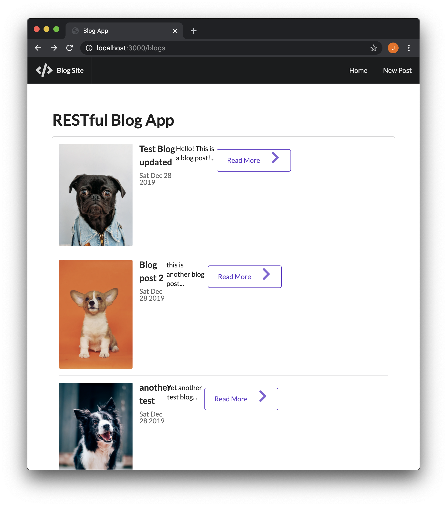
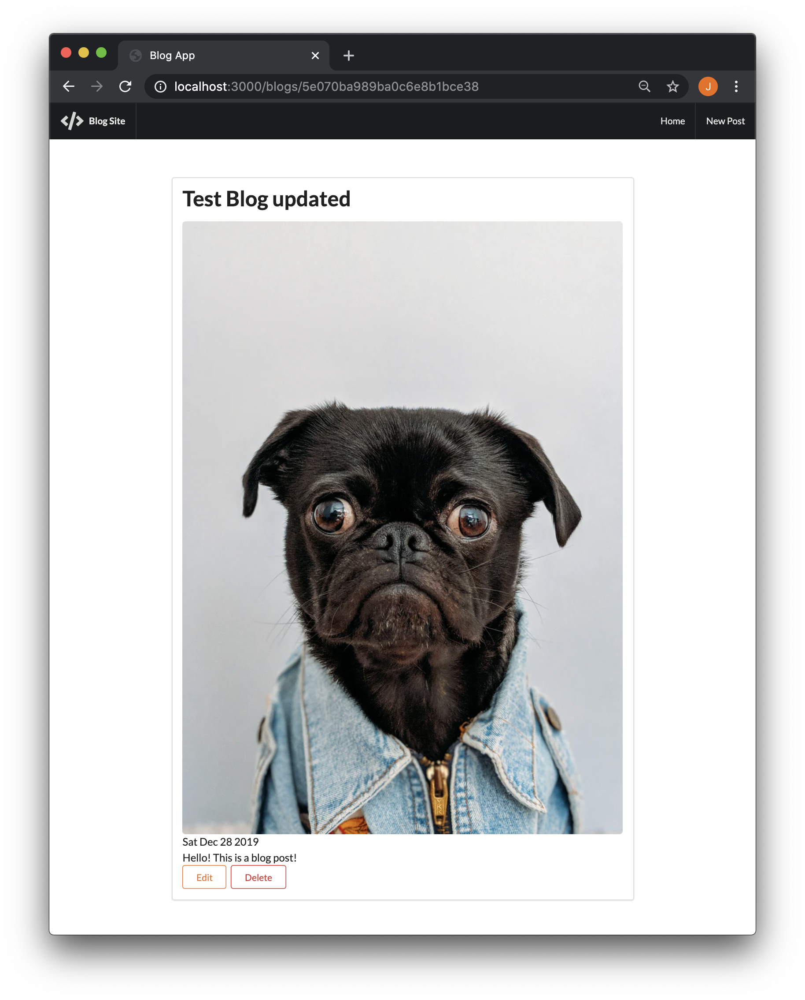
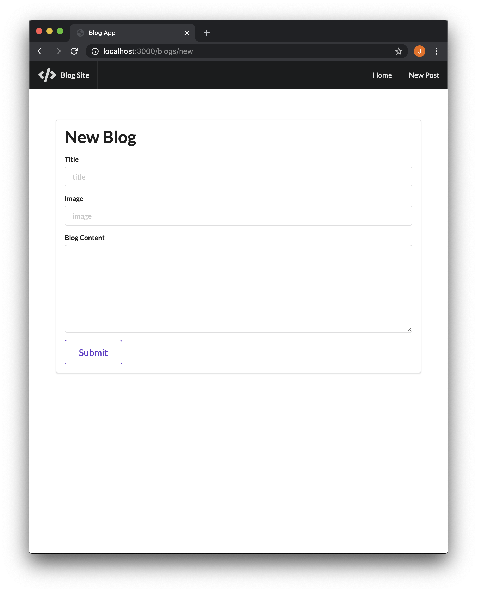
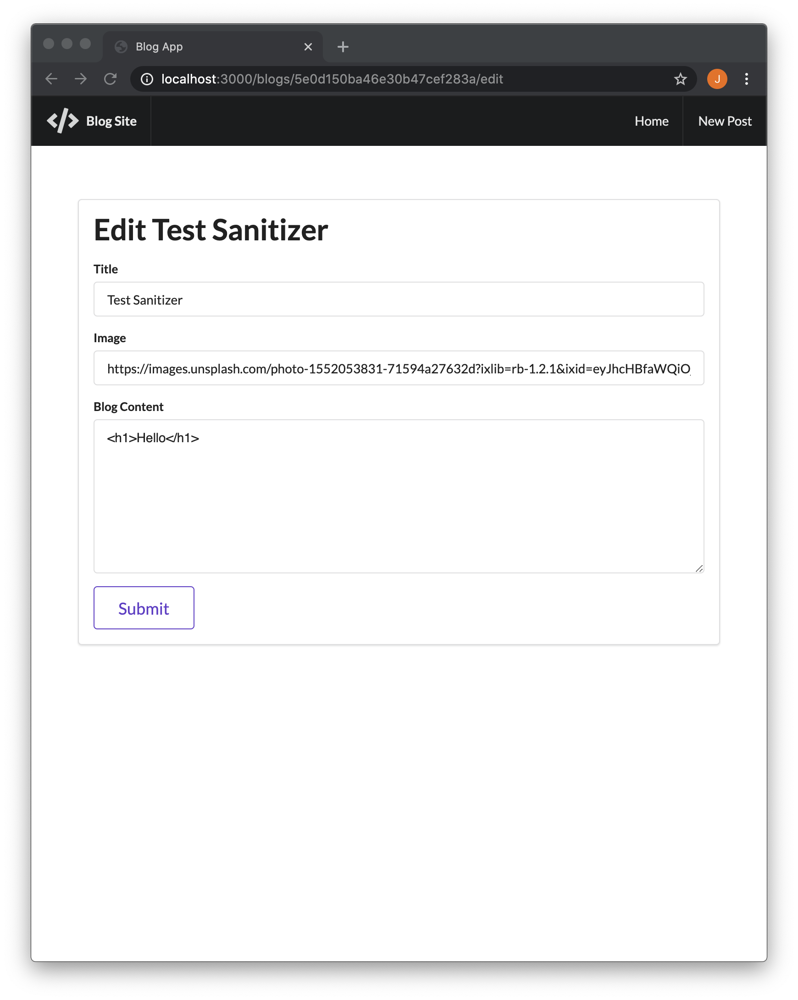

# Blog App
#### Author: Jesnine Erillo
This is a blog application created for a web dev course on Udemy.

## Features:
- Interface created using Semantic UI
- Used NodeJS and Express for server-side Javascript
- Data retention of blog posts and their contents using MongoDB
- Utilized RESTful routing conventions to direct users and create a responsive design
- Post sanitization to prevent blog posts with inline HTML from potentially breaking the app

## Screenshots:
**Homepage:**    

**Preview:**    
*Note: The window is zoomed out in order to fit entire preview.*   

**New post:**    

**Edit post:**

## To use:
- Navigate to `BlogApp/` in terminal and enter: `node app.js`
- Go to http://localhost:3000/ in browser
